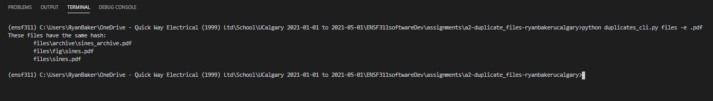

# a2-duplicate_files
Scan a directory tree and find duplicate files based on their hash

This assignment was inspired by Exercise 14.3 in ThinkPython 2e with code available at http://greenteapress.com/thinkpython2/code/find_duplicates.py.

Author: Ryan Baker 
# Problem statement
Utilizing functions in the modules `hash_functions.py` and `dir_functions.py`, a colleague put together initial code in `duplicates_cli.py`. This code allows you to specify a directory, and the program scans the directory recursively to find all files in this folder and sub-folders. For each file, its hash is calculated. A list of files with matching hash values is printed. These are potential duplicate files.

The goal is to:
1. Add docstrings and comments to functions in `duplicates_cli.py`
2. Change the code to use **MD5**, rather than **hash8** as the hashing algorithm. 
3. Add a command line interface inside the `cli()` function. The interface has one mandatory argument, `dirname`. Make sure to add command line description and argument help text.
4. Extend the code and command line interface with an optional argument to accept a file extension and only find duplicates with this file extension. The option should be `-e` and `--extension`. For text files, usage would be `-e .txt` or `--extension .txt`. Make sure to add help text.
5. (optional) Extend the code and command line interface to specify the hash algorithm used. Make sure to add help text.

# What to do
Work through goals 1. - 4. (optionally 5.) outlined above by editing `duplicates_cli.py` and using git to capture your changes. 

Document your code using the [style guide](StyleGuide.md). 

Using the sample file structure in the `files` folder, `python duplicates_cli.py files` should print
```
These files have the same hash:
        files/archive/sines_archive.pdf
        files/fig/sines.pdf
        files/sines.pdf
These files have the same hash:
        files/archive/test_archive.txt
        files/test.txt
        files/test_copy.txt
        files/txt/test.txt
        files/txt/test_copy.txt
These files have the same hash:
        files/test2.txt
        files/txt/test2.txt
```

`python duplicates_cli.py -e .pdf files` should print
```
These files have the same hash:
        files/archive/sines_archive.pdf
        files/fig/sines.pdf
        files/sines.pdf
```

Create a screenshots of your program running the following commands:
- `python duplicates_cli.py -h` 
- `python duplicates_cli.py files`
- `python duplicates_cli.py -e .pdf files`  
  
Create another screenshot of running tests `pytest -v`. 

Edit `README.md` (this file) and include the screenshots and instructions how to run your code/tests in the *How to run this program* section below (similar to a0-classroom).

In the section *Reflection*, include what you liked or disliked; found interesting, confusing, challenging, motivating while working on this assignment.

Make sure final version of `duplicates_cli.py`, `README.md` and `screenshot1.png`, `screenshot2.png`, etc. are committed to git and pushed to github. 

# How to run this program
- To run this program, duplicates_cli.py needs to be in the active directory. Then, from a terminal, type `python duplicates_cli *directory*`, where *directory* is the name of the directory in which you wish to search. This is a required parameter, so if you wish to search the active directory, you must move to the parent directory (and move duplicates_cli.py to that directory). Execution of this command will search the specified directory for duplicates of all file extensions, by checking the MD5 hash of each file.
- To search for only a particular file extension, use the `-e` or `--extension` optional argument (without quotes). For example, `python duplicates_cli files -e .pdf` will only search the *files* directory for duplicates that have a *.pdf* extension.
- An additional `-p` command line option was added to enable printing of the actual hash used. This seemed appropriate, given that goal 5 wanted to be able to specify the hash used. Without this feature, goal 5 seemed kind of pointless (and unverifiable for an end user).

## Passed Tests
- Note: `test_get_hash_md5` had to be modified slightly to account for the additional options that were added to complete goal 5.
  - Old code: `expected_out_parts = ["[-h] [-e EXTENSION] dirname", "error: the following arguments are required: dirname"]`
  - New code: `expected_out_parts = ["[-h] [-e EXTENSION]", "dirname", "error: the following arguments are required: dirname"]`


## Output of `python duplicates_cli.py -h`

## Output of `python duplicates_cli.py files`

## Output of `python duplicates_cli.py -e .pdf files`



# Reflection
- There was some particularly frustrating troubleshooting that happened with pytest. I was able to get the correct output very quickly, but then spent a large part of a day trying to figure out the errors. I even went to the TAs for help, but they were unable to help resolve the problem. In the end however, it ended up being a result of not reading the documentation properly. The issue was that `parser.parse_args()` was originally called without passing in `args`. Once this was corrected (ie. `parser.parse_args(args)`), the tests passed.
  - This experience, though it was frustrating, was beneficial in that I learned other people's way of implementing the program was different than mine (and I found that a lot of people liked my way better). Most people passed in 
  `parser.extension`  to `get_hash()`, but all I did was use a list comprehension at the end, and used `string.endswith()` to print only those duplicates of the correct filename. This ended up being a more succinct way compared to others.
- Adding the additional functionality was fun!
